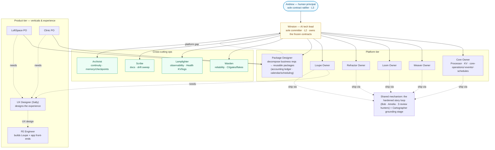
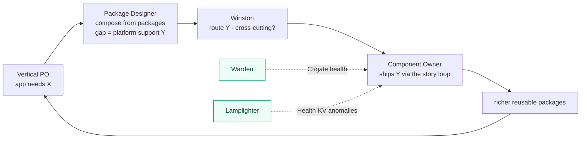
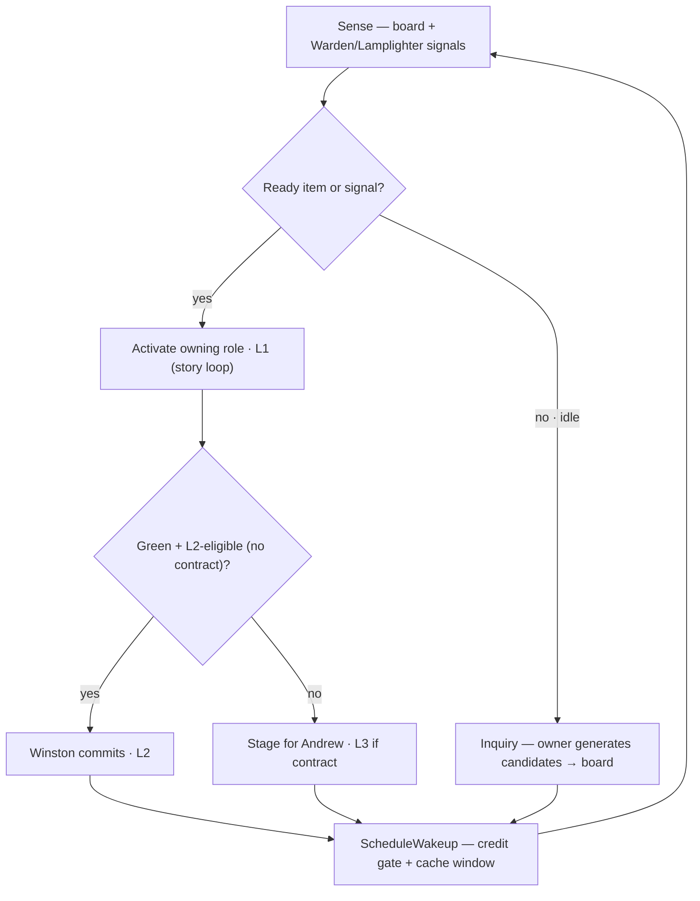

# Agentic Operating Model — autonomous roles & routines for continuous Lattice improvement

**Status:** team-reviewed (party-mode, 9 BMAD lenses); core shape ratified by Andrew. Bring-up not yet started.
**Owner:** Winston — this doc has a heartbeat: reviewed at each bring-up milestone so it doesn't drift.
**Purpose:** define the AI-agent roles, the org that connects them, the autonomy ceiling, and the concrete
Claude-Code mechanisms that drive continuous improvement in **reliability**, **observability**, and
**features** — largely unattended.
**North-star metric:** **Andrew-interventions per shipped change, trending down.** An *intervention* = any time
the org must wake Andrew (an L3 contract ratification, an out-of-class escalation, a correction). A *shipped
change* = a merged commit. Rising autonomy = this ratio falling. If it doesn't fall, the model isn't working.
**Scope read:** converging (Phase 3). Roles run as Claude-Code agents against the dev/local stack *now*, each
named to an on-platform descendant already specified in the PRD/brainstorm, and migrate on-platform later —
the same precursor pattern Loupe uses for Edge.

---

## 1. Framing — the dogfooding arc

Loupe is "the first Edge prototype, built *around* Edge machinery without the Edge security layer." This
applies that pattern to **operations**: stand up Lattice's AI-native ops loop as Claude-Code agents driving
the dev stack, built around the same closed-loop machinery a self-improving deployment will eventually run
on-platform. Every role names its on-platform descendant (FR31/FR32/FR53 AI-authored capabilities, FR54
anomaly detection, brainstorm #96 closed-loop auditor, #100 auto-circuit-breaker). The dev-loop version
earns trust off-platform first, then migrates onto Weaver/Loom/Loupe.

The substrate already exists: Health KV as a machine-legible signal plane
([health-kv-schema.md](../../docs/observability/health-kv-schema.md)), the CI gates, the 3-layer
adversarial review skills, the `backlog.md` Progress board, Loupe as a control surface, and
`internal/aiagent` proving cold-start traverse-and-submit (FR19). The whole point is measured by the
north-star metric above — every mechanism below either ships change or shrinks Andrew's surface.

---

## 2. The org

Two-gate top: **Andrew** (human principal) sits above **Winston** (the AI tech lead — *not* human; the
main-session persona). Winston is the sole committer; Andrew is the sole contract ratifier. Everyone below
prepares work in the tree and files requests up. Roles are **function-named** — the platform already owns
the evocative names (Loom/Weaver/Refractor/Loupe), so "the Refractor Owner" is unambiguous; invented names
are reserved for the cross-cutting ops roles where function alone is vague.

| Tier | Role(s) | Owns | Ladder |
|---|---|---|---|
| **Platform — components** | **Core Owner** (Processor + KV + core-operations/-events/-schedules), **Weaver / Loom / Refractor / Loupe Owners** | component-internal design, its backlog slice, its Health emission, intra-component stories. The **Loupe Owner additionally tracks the other components' consumer-facing surfaces** and updates Loupe to match (§6.1.1 dependency-change trigger) | L1 → Winston L2 |
| **Platform — solutions** | **Package Designer** | decomposing business reqs into reusable packages; composing Core/Weaver/Refractor/Loom; **flags platform gaps → Winston** | L1 |
| **Product — verticals & experience** | **LoftSpace PO**, **Clinic PO**; **UX Designer (Sally)** + **FE Engineer** | POs define what each app *does*; **Sally designs the UX**, the **FE Engineer builds it** — Loupe's operator UI + each vertical app's front-end | L0/L1 |
| **Cross-cutting ops** | **Warden** (reliability), **Lamplighter** (observability), **Scribe** (docs), **Archivist** (continuity) | platform-wide health; report to Winston | L0 → L2 (narrow) |
| **Shared mechanism** | the hardened **story loop** + **Cartographer** grounding stage | *how* every owner ships | — |

---

## 3. The autonomy ladder

"Elevating autonomy" = broadening what runs before a human is needed, *not* removing the gate. Each role is
pinned to a rung and promoted as it earns trust; the human surface shrinks (the north-star metric tracks it).

| Rung | What the agent may do | Gate above it |
|---|---|---|
| **L0 Advisory** | observe, classify, report (chip / backlog note). No writes. | — |
| **L1 Prepare** | prepare a design/fix **in an isolated worktree**, stop. | Winston review |
| **L2 Commit-behind-gates** | **Winston only** — review the worktree diff and merge to `main` iff all gates green **and** no frozen contract touched **and** the change is **L2-eligible** (risk-bounded — see below). | Andrew (contracts + architecture) |
| **L3 Propose-contract** | flag Andrew; edit the contract **in `main`, uncommitted** (never in a worktree) until ratified. | Andrew ratifies |

The existing house rule ("sub-agents never commit; Winston commits") is preserved. **L2-eligibility is
risk-bounded, not size-bounded** (ratified — widened from the initial narrow start): Winston may merge a change
without waking Andrew iff all gates are green (incl. CI), it touches **no frozen contract**, and it is
revertible. **Size does not cap eligibility — XS through L all qualify**; size sets *review depth* (a thorough
lead review for a small-green change — **XS/S/M**; **full 3-layer adversarial review for L+ *or* any
security / capability-plane or contract-adjacent change regardless of size**) and whether the work
spans fires (**multi-fire:** a big item stays in a persistent worktree with a board CHECKPOINT and merges only
when complete + green — main is never left partial). **Escalated to Andrew, never auto-committed:**
frozen-contract changes (L3) and genuinely architectural / design-heavy work (produce a design doc, not an
implementation).

**Gate-hardening (ratified).** Two safety rules on otherwise-L2-eligible work:

- **Health-emission changes** must update the **canonical** Health-KV schema doc *in the same change* — that
  keeps them L2-safe (the schema doc never diverges from the emission; the STRICT linter + the rollup catch
  shape errors). A wrong key shape silently rots the observability plane — a regression already eaten once.
- An **L2 "flake-fix"** is allowed only when the flake classification meets a deterministic bar — **N-of-N
  reproductions + a `FLAKE_REGISTRY` entry** — before the word "flake" is used. *A real failure mislabeled as
  a flake is the one unforgivable case;* when in doubt it is real, and it escalates rather than auto-merging.

**Isolation rule.** *All* work happens in an isolated **worktree** — owners, ops routines, the Forge — so
parallel agents never conflict; Winston reviews each worktree diff and merges to `main`. The **sole exception
is a contract change**: a frozen-contract amendment is edited **in `main`, uncommitted**, because it must be
platform-visible for Andrew's review and for other agents to build against — it cannot be hidden in a
worktree. Shared coordination artifacts — the `backlog.md` board and `memory/` — are written by **Winston /
the Steward** and by the **staggered PO loop** (which commits its own demand filing, docs-only), **never by
owners from inside parallel worktrees** — that, plus the 3h stagger between the two scheduled loops, is what
avoids board merge conflicts. (The PO commits its filing rather than leaving it uncommitted so the board stays
durable and the Steward reads committed state.)

---

## 4. Roles → area, descendant, mechanism

| Role | Area | On-platform descendant | Primary Claude mechanism |
|---|---|---|---|
| **Core / Weaver / Loom / Refractor / Loupe Owner** | features | the component itself, AI-driven (FR31 authorship for its DDL/Starlark/lenses) | a per-component **skill** + an owner **subagent**; **activated by the Steward (§6.1.1)** on pull / signal / dependency / sweep; consults Cartographer; ships via the story loop |
| **Package Designer** | features (composition) | FR31/FR32 capability bundles assembled from packages | a **skill** encoding decompose→compose→gap-flag; emits feature requests up |
| **Vertical PO (LoftSpace, Clinic)** | features (product) | the app's own AI assistant over FR19 traversal | a **skill** producing briefs + app-front-end stories |
| **UX Designer (Sally)** | features (experience) | the apps' UIs over FR19 + DDL self-description (`inputSchema` / `fieldDescription` drive forms) | **`bmad-agent-ux-designer` (Sally)** + `bmad-create-ux-design` — designs the experience (flows, layout, interaction), hands a spec to the FE Engineer |
| **FE Engineer** | features (experience) | the human face of the self-describing graph | **`agents/fe-engineer`** — builds Loupe's operator UI (`cmd/loupe/web` vanilla HTML/CSS/JS + Go handlers) + vertical-app front-ends from Sally's design; verifies in-browser (preview) |
| **Warden** | reliability | #100 auto-circuit-breaker (Weaver PAUSE + investigation Task) | a **routine** (`/loop` + `ScheduleWakeup`) over CI status + a root-cause subagent (deferred — see §8) |
| **Lamplighter** | observability | #96 closed-loop auditor (reads Health KV → remediation) + FR54 anomaly detection | a **routine** (`/loop`) polling Health KV against a live `up-full` stack |
| **Archivist** | continuity | FR33/FR50 persisted intent across sessions | **memory** + a checkpoint **skill**, run at gate boundaries |
| **Scribe** | docs | the self-describing graph keeps the *running* system legible (FR19 + DDL self-description); the Scribe keeps the *repo* docs legible | **`bmad-agent-tech-writer` (Paige)** + `bmad-index-docs`, run as a periodic drift sweep |
| **Cartographer** (stage, not standing role) | grounding | FR19 cold-start traversal | the **Explore subagent**, mandatory stage-0 of every design/story |

---

## 5. The flywheel — the feature engine

The Package Designer + Vertical POs wire up a closed demand→supply loop. This *is* "continuous improvement
in features," now with a named driver at each hop; Warden and Lamplighter feed the same owners with the
reliability/observability signals.

With one real vertical (LoftSpace) the loop is only half-proven. The **clinic vertical is run as a deliberate
validation of the flywheel** — does product demand actually pull deferred platform work (`@every` schedules,
the Vault/crypto-shred plane, bridge I/O) into existence? — not as a thought experiment.

---

## 6. Autonomy mechanisms — scheduled routine (unattended) + in-session loop

Two drivers, selected by whether Andrew is present:

- **Unattended — the active operating mode.** A **local scheduled-tasks routine** (`steward-autonomous`,
  `~/.claude/scheduled-tasks/`) fires the **Steward** on a cron — currently **every 6h** — with **no session
  from Andrew**. This is the genuinely-autonomous mode. Each fire **cold-starts** and re-grounds from durable
  state — the board (`backlog.md`), `memory/`, and this design doc — which is exactly why those artifacts are
  kept truthful (cold-start is the cost; durable context is what makes it tractable). Unattended commit policy
  is the **ratified L2-eligible set** (risk-bounded — gated, contract-free, revertible; *any size*, with review
  scaled to size and big items spanning fires); frozen-contract and architectural work escalate to Andrew on
  the board, never committed. *Caveat:* a local scheduled task fires only while the Claude app is running (or on
  next launch if it was closed when due) — true server-side unattendedness is the cloud-routine step below.
  - **Two staggered loops — supply + demand.** Alongside the Steward (supply) runs a second scheduled task,
    **`vertical-po-discovery`** (cron `0 3,9,15,21` — offset 3h so the two never collide writing the board):
    a **Vertical PO** exercises one vertical's packages/app/flows, thinks as the product owner, and **files
    scored backlog items** — the *demand* side of the flywheel. It is **file-only (L0/L1)** — it never builds
    or commits; the Steward builds what it files. Without it, demand-generation starved behind building in the
    single queue and the board ran dry ("nothing actionable"); the two-loop split keeps demand flowing.
- **In-session — when Andrew is driving.** The **dynamic `/loop` + `ScheduleWakeup`** pattern: context-warm
  (resumes inside the live session with the tree, memory, and prior reasoning intact), state-paced (wakes on
  whether there's work, not a blind tick), token-budget-aware (respects the prompt-cache window, §6.6), and
  interruptible. The inter-story credit-window gate already runs this way (CLAUDE.md).

**Cloud-scheduled routines** (server-side, no dependency on Andrew's machine/app being open) are the next
step beyond the local runner — same Steward prompt, hosted execution.

### 6.1 Routines (`/loop` + `ScheduleWakeup`)

| Routine | Role | Trigger / cadence | Output |
|---|---|---|---|
| **Steward** | Winston | self-driving dispatch `/loop`; wakes on the credit-window epoch gate + cache window (§6.1.1) | selects & activates the next owner, admits/commits output, replenishes the board when idle |
| **Vigil** | Lamplighter | self-paced `/loop` while an `up-full` stack is up: poll `lattice health summary` / Health KV | anomalies → chips / backlog entries |
| **Scribe-Sweep** | Scribe | self-paced `/loop`, low frequency (idle-fill): audit `docs/` against code + contracts for drift | doc fixes (L1 → L2 docs class) + a refreshed `bmad-index-docs` index |
| **Green-Watch** | Warden | self-paced `/loop`: poll `gh run` after a push; tight cadence in-flight, idle long-hop when green | green confirmed, or a classified failure + an L1/L2 fix (deferred — §8) |

Cadence discipline (from the `ScheduleWakeup` contract): poll an in-flight CI/stack at ~**270s** to stay
inside the 5-min prompt cache; drop to **1200–1800s** idle hops when there is nothing to watch. Never the
worst-of-both 300s.

#### 6.1.1 Owner activation — the Steward loop & Inquiry

Ops roles are self-triggering (signals fire them). **Owners are not** — without a dispatcher, a component
owner never acts. The **Steward** is Winston's self-driving dispatch `/loop` (the formalization of the
autonomous-mandate "drive the story loop," generalized from one linear sequence to a multi-owner pull +
inquiry-replenish loop). It activates owners under four triggers:

| Trigger | Source | What the owner does |
|---|---|---|
| **Pull** | a ready item on the board owned by me | ship it via the hardened story loop (L1) |
| **Signal-reactive** | Warden / Lamplighter signal, or a demand request filed by a PO / Package Designer | inquire → root-cause / scope → prepare a fix or feature (L1) |
| **Dependency-change** | a producer ships a consumer-facing surface change (a control op, a Health key, a DDL self-description field, an object-store API) | the consuming owner updates to surface / handle it (L1) |
| **Proactive sweep** | *idle-fill* — no ready item and no signal | run the **Inquiry skill**: generate improvement candidates and file them to the board |

The **Loupe Owner** is the heaviest consumer of the dependency-change trigger — Loupe surfaces *every*
component (Core KV, the Refractor / Weaver / Loom control planes, Health KV, the object store, DDL-driven op
forms), so most surface changes route an update to it. A **dependency map** (consumer → producers), **derived
from code signals** (§8), drives this trigger.

The **Inquiry skill** ("how can I make my component better") reads the component's Health emissions, its
flake/CI history, the Deferred / Implementation-status section of its `docs/components/<x>.md`, open
TODO/FIXME, recent diffs, coverage/lint gaps, and inbound feature requests — then files candidates **scored
against a Winston-owned rubric** and admitted to the board only when they meet a **definition-of-ready**.
Owners **file and prepare only** — they never self-prioritize above Winston.

**Decide, don't defer (the prime directive).** The Steward *is* Winston; implementation and design decisions
are **his**. Exactly **two** things escalate to Andrew: a **frozen-contract change** (`docs/contracts/*`) and a
**final architectural / platform fork** (Gateway, read-path auth, Vault, multi-cell, HA-NATS — anything that
reshapes the trust boundary / topology / security posture). Everything else — handler / API shape, data model,
freshness model, naming, how the trusted dev tool sources its data, test choices — Winston decides *now* and
builds; product / scope / priority questions route to the **PO**, not up to Andrew. Two failure modes are
explicitly forbidden because they masquerade as caution: **parking an implementation question on the board and
stopping** (decide it instead), and **concluding "nothing actionable"** (a defect — a lower lane wasn't
worked). "Bias to safety" means *never red main / never a frozen contract / never force-push* — not "don't
decide"; an implementation call is safe precisely because it's gated, reviewed, and revertible.

**But never override a standing Andrew decision.** Decide-don't-defer means *don't route new questions up to
Andrew*; it does **not** mean reverse a call he already made. If Andrew has explicitly blocked, rejected, or
stated a preference (a board row says "blocked by Andrew", a design doc records his objection, he rejected the
presented options), that is a **hard Andrew-gate** — leave it, even if the underlying question looks
implementation-level. A component's **external data-access / dependency / trust model** (e.g. *does Loupe read
the local filesystem* — the agent-activity console's §4 read-seam, which Andrew is holding) leans
architectural — Andrew's call — not in-component implementation. When a parked item *might* be timidity vs. a
real gate, check whether Andrew touched it: if he did, it stays his.

**Work-finding never dead-ends — build → design → inquire.** An implement-only loop stalls the moment the
easy build lane drains and everything left "wants human design review" (observed: a real cycle drained the
ride-along cleanups and idled; another hit an implementation question, wrote it on the board, and stopped as
"nothing actionable" instead of deciding it). So the ladder has three tiers, and "nothing actionable" almost
always means a lower tier wasn't worked:

1. **Build** the top L2-eligible item — broader than the named cleanups: it *always* includes design-free
   continuous improvement (test-coverage gaps, doc/Scribe sweeps, observability build-out incl. the Loupe
   operator surfaces, simplification/refactor passes).
2. **Design** the next item — if nothing is build-ready, the loop *produces the design* rather than escalating
   a bare "needs design" note: ground → a reviewable design doc (`implementation-artifacts/`) →
   adversarial/party review → **then resolve its open questions (prime directive): if they are all
   implementation / design calls (the normal case), Winston ratifies them in the same fire, the doc is marked
   `✅ Winston-ratified — build-ready`, and the loop builds it.** A doc carries **📐 awaiting-ratification**
   only for the *specific* part that is a frozen-contract change or an architectural fork — that part is
   flagged, the rest is built. *Exception:* items whose **fork itself** needs a strategic direction-call
   (Gateway, read-path auth, Vault, multi-cell) get an options-sketch + "needs your direction" flag, not a
   full auto-design — but their downstream implementation is still Winston's.
3. **Inquire** — only when there is nothing to build *or* design, replenish candidates.

Escalation stays a *proposal, never a decision* **for the two Andrew-items only**: the loop never commits a
frozen contract and never makes a *final architectural fork* unattended. It does **not** escalate ordinary
design questions — it answers them.

Steward iteration:

**Guardrails.** A **WIP cap** bounds how many owners the Steward runs concurrently (worktree-isolated) —
bounding token spend and board churn. Reliability/observability signals **pre-empt** the queue (a red gate or
Health anomaly jumps ahead of feature pulls). A **starvation / aging guard** raises long-skipped low-importance
*items* over time so nothing is indefinitely deferred. **Component coverage** is the *component*-level analog:
a demand-driven `importance×readiness` pick would let a component with no loud backlog (a quiet Loupe/Loom) go
neglected, so the Steward also tracks each component's freshness via `git log -1 --format=%ct -- <path>`
(stateless, like the dependency map) and, when the **stalest component exceeds ~3 days untouched**, pre-empts a
routine pick with **that component's Inquiry** — guaranteeing every component rotates through attention
regardless of where the loud items are. Andrew may set a **per-cycle theme** that biases selection. Inquiry
fires from three triggers — idle-fill, signal-reactive, and **coverage-rotation** — never every tick, so the
board is replenished, not spammed. **Batching:** a fire is not capped at one item — **everything that is not
Large is a small win**, so for **XS / S / M** items the Steward ships several per cycle (each its own green
commit) until it would start an **L (or XL)** item, the eligible queue drains, or the budget says stop; an L+
item is still one-per-cycle (multi-fire). A six-hour fire shouldn't idle after a single small win.

### 6.2 Hooks (deterministic, harness-run — settings.json)

Hooks catch convention/quality violations **before CI**, so the gates stay meaningful and Warden has less to
clean up:

- **`PostToolUse` (Edit|Write)** → `gofmt` + `go vet` on touched packages.
- **`PostToolUse` (Edit|Write)** → a **contract-conformance linter** (new, small): key-shape regex enforcing
  Contract #1 — reject `asp.*` prefixes, short-form 6-segment links, `vtx.meta.<canonicalName>` — and the
  **no-history-comment** rule (reject `// Story …`, `// Previously …`, `// renamed from …`).
- **`Stop` / `SessionStart`** → emit/refresh a `CHECKPOINT` (see §6.5).

### 6.3 Skills (`.claude/skills/<role>/SKILL.md`)

Each role's loop is encoded as a skill so it kicks off consistently without re-explanation, reusing the
existing BMad cast rather than reinventing it:

- **Owner skills** — wrap `bmad-create-story` → `bmad-dev-story` → the 3-layer review (`bmad-code-review`
  hunters) → gate run, pinned to that component's mandate (`docs/components/<x>.md`) and the frozen contract.
- **Package-Designer / PO skills** — decompose→compose→gap-flag, and brief→app-story respectively.
- **Ops skills** — Vigil, Scribe-Sweep (over `bmad-agent-tech-writer` + `bmad-index-docs`), Green-Watch, and
  the Archivist checkpoint/consolidate routine (over `consolidate-memory`).

**Docs — both layers, mirroring reliability's hooks-plus-Warden split.** *As-you-go* is the default: updating
the component's own `docs/components/<x>.md` is part of the story-loop **Definition of Done**, enforced by the
Acceptance Auditor gate — so component-local docs stay fresh by construction. The **Scribe** sweep owns only
what no single story owns: the cross-cutting docs (`README`, `architecture-overview.md`, the contracts index)
and drift between them.

**The static diagram is low-churn by design.** Minimal-core + everything-is-a-package means new *capabilities*
arrive as packages, not new *components* — the component set (Core, Refractor, Weaver, Loom, Bridge, Loupe) is
deliberately small and stable, so `architecture-overview.md`'s structural picture rarely changes and the Scribe
tends it only occasionally. The Scribe reviews doc **quality** (clarity, not merely existence) and keeps the
**canonical reference docs** (the Health-KV schema, the contracts index) in lockstep with any change that
touches them. The *operational* truth — what is actually running and its health — moves to Loupe's **live
system map** (§7); a live diagram generated from Health KV + Core KV cannot go stale.

### 6.4 Isolation, subagents & workflows

- **Worktrees are the default unit of isolation** (per the §3 isolation rule) — *every* work unit runs in its
  own worktree, not only parallel ones; contract changes are the sole exception (edited in `main`,
  uncommitted). Winston reviews each worktree diff and merges.
- **Subagents** (`Agent` / `subagent_type`) — component owners run as owner subagents; **Cartographer** is the
  `Explore` subagent run as mandatory stage-0; the three review hunters run in parallel (the existing rigor).
- **Workflow** (opt-in, "ultracode") — the **Forge**: fan out one backlog item per worktree, each through the
  full grounded loop, with an adversarial contract-conformance gate before any item returns to Winston for
  commit. The Forge is simply the parallel case of the always-on worktree default.

### 6.5 Memory & checkpoints (continuity)

The Archivist keeps continuity truthful — directly countering the drifted-handoff failure mode:

- **Memory** (`memory/` + `MEMORY.md`) — durable cross-session facts; the Progress board (`backlog.md`) is
  the work index, never agent memory (house rule).
- **CHECKPOINT protocol** — after every gate, write a terse state file (done / current / exact-next-steps) so
  a fresh session resumes without drift if a turn is interrupted. **Verify handoffs against actual files
  before saving** (the established anti-drift rule).

### 6.6 Token-budget awareness

Per the established stance, budget is **tracked, self-paced, and checkpoint-protected — not hard-halted**
(halts are stuck-loop, not token-ceiling). Mechanisms:

| Concern | Mechanism |
|---|---|
| Don't burn tokens polling idle | dynamic `/loop` self-pacing; long idle `ScheduleWakeup` hops |
| Stay cache-warm | wake at <300s only when actively watching; else 1200s+ (§6.1) |
| Scale depth to a budget directive | `Workflow` `budget` object — `budget.total` / `remaining()` to size the Forge fleet and finder depth |
| Survive an interrupted turn | CHECKPOINT after each gate (§6.5); the ladder bounds work-before-surface |
| Bound a single run | the autonomy ladder — an agent stops at its rung and hands up, rather than running unbounded |

---

## 7. Operator surface — the Loupe agent console

The model is otherwise all back-end roles; Andrew needs one place to *see* the org and to act at the L3 gate
— in 30 seconds: what shipped overnight, what's waiting on his contract-review, what's stuck, what the Steward
is about to do. That place is **Loupe** (it already renders Health and the control planes). Two layers, both
filed to `planning-artifacts/backlog.md` (Loupe-owned):

- **Platform layer — the live "system map" landing page.** The running component + data-flow topology rendered
  live: per-component/lens Health colour, edge/link status, drill-in to a vertex or a control plane.
  Self-truthing (Health KV + Core KV), so it never drifts. (The static `architecture-overview.md` keeps the
  full *designed* whole — Gateway, Vault, Edge — for teaching; the live map shows the *running* subset.)
- **Ops layer — the agent-activity console.** Atop the map: the **Steward's queue** + work in flight, the
  **board** state, per-agent Health, and — Andrew's primary touchpoint — the **L3 contract-review queue**
  rendered as *what changed / why / which consumers it affects* (the affected-consumers view is exactly the
  §8 dependency map), not a raw pile of uncommitted diffs. Good L3 UX is where last-inch autonomy is won or lost.

**Dogfooding.** The ops agents (Steward, Lamplighter, Warden, Scribe, Archivist) **emit Health KV like any
component**, so Loupe watching the platform watches the agents for free — the dependency-watch (§6.1.1) turned
on its own authors.

---

## 8. Bring-up order & enabling gaps

Andrew's call: **stand up the full org now** (not a phased MVP) — but bring it online in a safe order and with
the gates hardened (§3). Since CI has been green-enough, **Warden is deferred**; the bring-up pair is the
**Steward** (the engine that makes owners act) and **Lamplighter** (the eyes — you do not ship autonomously
into a dark room). Concrete enabling work, each a candidate first story:

1. **Steward loop + Inquiry** — the dispatcher (§6.1.1): the four triggers, the Winston-owned scoring rubric,
   the definition-of-ready, the starvation guard. (S)
2. **Lamplighter v0** — *grounding correction:* **Weaver and Loom already emit** rich Contract #5 heartbeats to
   `health.weaver.*` / `health.loom.*` (`internal/{weaver,loom}/health.go` — consumers, targets, marks, sweeps,
   timers, running-instances, `ConsumerPaused` issues), so there is **no emission prerequisite**. The gap is the
   **consumer side**: Lamplighter reads all of `health-kv`, classifies anomalies (stale heartbeat ·
   `consumerLag>0` · paused consumers · `issues[]` entries), and surfaces remediation. Confirm
   `lattice health summary`'s `classifyKey` recognizes the weaver/loom keys. (S)
3. **Health-KV schema doc refresh (Scribe)** — the **canonical** `docs/observability/health-kv-schema.md` still
   lists `health.weaver.*` / `health.loom.*` as reserved/unemitted — stale since Phase 2 shipped the emission.
   Document the real doc shapes, metrics, and issue codes. Dogfoods the Health-emission gate (§3); the Scribe's
   first real drift catch. (XS)
4. **Contract-conformance linter** — powers the §6.2 hook; encodes Contract #1 + no-history-comments. (XS)
5. **Dependency map (derived)** — `consumer → producers` **derived from code signals** (imports, control-plane
   subjects, the substrate surface), *not* a hand-maintained table that would itself drift; drives the
   dependency-change trigger and the L3 affected-consumers view. (S)
6. **CHECKPOINT protocol** — the §6.5 state file + the Stop/SessionStart hook. (XS)
7. **Backlog Owner column** + **role skills** + the **Loupe operator surfaces** (§7, both filed). (XS / S / M)
8. **Warden (deferred)** — Green-Watch + `FLAKE_REGISTRY` + the flake bar (§3); stand up when reliability
   actually bites.

---

## 9. Decisions

**Ratified.**

*Org & rollout*

1. **Full org now** — not a phased MVP; bring online in a safe order (§8).
2. **Bring-up pair = Steward + Lamplighter** (Weaver/Loom *already* emit Health — no emission prerequisite;
   Lamplighter is consumer-side); **Warden deferred** (CI green-enough).
3. **Contract ownership** — Winston owns the frozen contracts; the **Core Owner** owns the stream
   *implementation* and holds **delegated authority for non-breaking stream additions**; an owner escalates to
   Winston on a contract touch, a cross-component interface change, or anything needing another component.

*Gates & autonomy*

4. **L2-eligibility is risk-bounded, not size-bounded** — gated + no-frozen-contract + revertible; XS–L all
   qualify (size sets review depth + multi-fire, not eligibility). Contracts + architectural work escalate (§3).
5. **Gate-hardening** — review scales to risk (lead for small-green XS/S/M, **3-layer for L+ or any
   security/capability-plane change**); Health-emission must
   co-update the canonical schema doc in the same change; an L2 flake-fix requires the **flake bar** (N-of-N +
   registry); Inquiry candidates are scored against a **Winston-owned rubric** + **definition-of-ready**, with
   a **starvation guard** (§3, §6.1.1).
6. **Isolation** — all work in worktrees; sole exception = contract changes (in `main`, uncommitted);
   coordination artifacts (board, memory) written centrally (§3).
7. **North-star metric** — Andrew-interventions per shipped change, trending down (header).

*Surfaces, docs, verticals*

8. **Operator surface** — the Loupe live system map + agent-activity console + structured L3 review; ops agents
   emit Health KV (§7); two backlog items filed.
9. **Docs — both layers** — as-you-go in the DoD + the Scribe sweep; the static diagram is low-churn by design,
   the live truth is Loupe's map (§6.3).
10. **Loupe cross-component watch** — the dependency-change trigger, driven by a **code-derived** dependency map
    (§6.1.1, §8).
11. **Second vertical = clinic**, run as a real **flywheel validation** (does demand pull deferred platform work
    into existence?), forcing `@every` / Vault / bridge I/O.
12. **Backlog** — single board + Owner column now; shard a slice into its own file only when it outgrows the board.
13. **This doc** — owner Winston, reviewed at each bring-up milestone.

**Still open (tuning knobs, with recommended defaults).**

14. **Steward WIP cap** — concurrent owners per cycle. *Rec: 1 to prove the loop is safe, then 2–3 behind worktrees.*
15. **Inquiry cadence** — *Rec: idle-fill + a light sweep when a component hasn't been inquired in the last ~3–5
    shipped items; floor of once / component / cycle.*
16. **Per-cycle theme** — *Rec: support an optional Andrew-set focus; default off → importance×readiness.*

---

## 10. Role & term glossary (one-pager for a cold reader / sub-agent)

**Tiers:** *Andrew* (human principal, sole contract ratifier) › *Winston* (AI tech lead, sole committer, owns
contracts) › the platform / product / ops roles below.

| Term | One line |
|---|---|
| **Component Owner** (Core / Weaver / Loom / Refractor / Loupe) | drives its component forward; files + prepares (L1). The Loupe Owner also tracks others' surfaces |
| **Package Designer** | composes Core/Weaver/Refractor/Loom into reusable packages; flags platform gaps up |
| **Vertical PO** (LoftSpace, Clinic) | defines what an app *does* + drives its front-end |
| **UX Designer** (Sally) | designs the experience (flows, layout, interaction) for Loupe + the vertical apps |
| **FE Engineer** | builds the front-ends from Sally's design — Loupe (vanilla HTML/CSS/JS) + vertical apps |
| **Warden** | reliability — CI / gates / flakes (deferred until reliability bites) |
| **Lamplighter** | observability — watches Health KV / logs against a live stack |
| **Scribe** | docs — drift sweep over cross-cutting docs + canonical references |
| **Archivist** | continuity — memory + checkpoints |
| **Cartographer** | grounding — the mandatory read-only code/contract map run before any design (a stage, not a standing role) |
| **Steward** | Winston's self-driving dispatch loop that activates owners (pull / signal / dependency / sweep) |
| **Inquiry** | an owner's "how do I improve my component" generative pass → scored, ready board candidates |
| **Forge** | the parallel case — fan out items across worktrees via a Workflow |
| **The ladder** | L0 advise · L1 prepare-in-worktree · L2 Winston-merges-behind-gates · L3 contract-to-Andrew |
