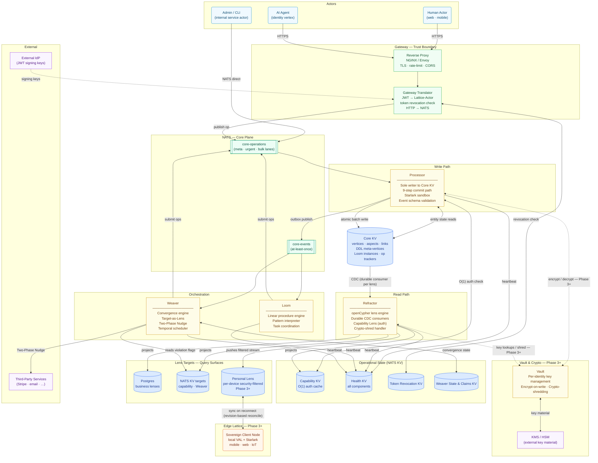

# Lattice Architecture Overview

This diagram shows the full platform as designed — including components that are implemented today and those planned for later phases. See [Project status](../README.md#project-status) for what is built now.

## Key data flows

**Write path (left side, top-down):**
Clients submit operations over HTTPS → the Gateway authenticates the actor (JWT), stamps `Lattice-Actor`, and publishes onto `core-operations`. The Processor consumes the operation, checks authorization against Capability KV, hydrates entity state from Core KV, runs the Starlark script, validates the resulting mutations and events against DDL, and commits everything atomically to Core KV. A transactional outbox consumer then publishes business events to `core-events`.

**Read path (right side, CDC-driven):**
The Refractor holds one durable JetStream consumer per active Lens. Each consumer watches Core KV's backing stream, evaluates openCypher rules, and projects results into target stores — Postgres tables for business queries, NATS KV for the Capability cache (auth) and Weaver targets, and Personal Lens streams for edge clients.

**Orchestration (bottom loop):**
Loom and Weaver consume `core-events`, then submit new operations back through `core-operations` → Processor → Core KV. They never write state directly; the ledger is the only source of truth. Weaver's Two-Phase Nudge reaches external services via a claim-before-execute protocol recorded in `weaver.claims.>`.

**Authorization (always-on, not a separate call):**
The Capability Lens is a Refractor projection that continuously maintains a flattened permission cache in Capability KV. The Processor reads it at O(1) in commit-path step 3. No separate auth service; auth correctness is projection correctness.

## Phase status

| Component | Phase |
|-----------|-------|
| Substrate (NATS/KV primitives), Processor, Refractor, Capability Lens | ✅ Phase 1 — implemented |
| Identity & RBAC packages, Hello Lattice vertical slice | ✅ Phase 1 — implemented |
| Package install/uninstall, transactional event outbox, per-lens delete mode | ✅ Phase 1.5 — implemented |
| Loom, Weaver, Two-Phase Nudge, `orchestration-base` package | 🔨 Phase 2 — in progress |
| Gateway (JWT auth, token revocation, HTTP→NATS translation) | 🔭 Phase 3 — designed |
| Vault, crypto-shredding, KMS integration | 🔭 Phase 3 — designed |
| Edge Lattice, Personal Lens, offline-first sync | 🔭 Phase 3+ — designed |
| Cells & sharding, multi-cell routing | 🔭 Phase 3+ — designed |

## Related reading

- [Component reference pages](./components/README.md) — per-component deep dives
- [Data contracts](./contracts/README.md) — wire shapes, key patterns, behavioral rules
- [Deployment isolation model](./operations/deployment-isolation.md) — per-deployment NATS and Postgres
