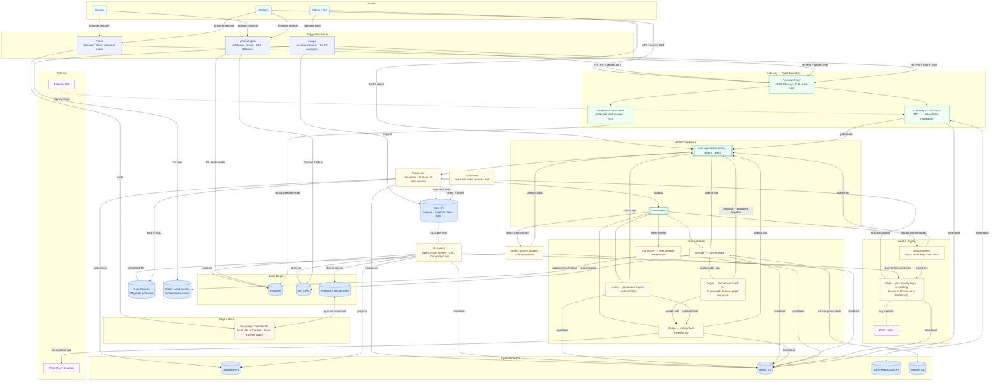

# Lattice Architecture Overview

This diagram shows the full platform as designed — including components that are implemented today and those planned for later phases. See [Project status](../README.md#project-status) for what is built now, and the [phase table](#phase-status) below for the per-component breakdown. Loupe's live system map (`GET /api/systemmap`) renders the deployed subset of this topology with a Health-KV overlay.

```mermaid
flowchart TB
    subgraph Actors
        Human("Human"); AI("AI Agent"); Admin("Admin / CLI")
    end

    subgraph Apps["Experience Layer"]
        VApps["Vertical apps<br/>LoftSpace · Clinic · Café · Wellness"]
        Facet["Facet<br/>discovery-driven personal client"]
        Loupe["Loupe<br/>operator console · the P5 exception"]
    end

    subgraph EdgeLattice["Edge Lattice"]
        EdgeNode("Sovereign Client Node<br/>local VAL + Starlark · Go or browser wasm")
    end

    subgraph GW["Gateway — Trust Boundary"]
        Proxy["Reverse Proxy<br/>NGINX/Envoy · TLS · rate-limit"]
        Trans["Gateway — translator<br/>JWT → Lattice-Actor · revocation"]
        ReadFront["Gateway — read front<br/>protected read models · RLS"]
    end

    subgraph NATS["NATS Core Plane"]
        Ops[["core-operations (meta · urgent · bulk)"]]
        Evts[["core-events"]]
    end

    Boot["Bootstrap<br/>one-shot: seed kernel + exit"]
    Proc["Processor<br/>sole writer · Starlark · 9-step commit"]
    CoreKV[("Core KV<br/>vertices · aspects · links · DDL")]
    Refr["Refractor<br/>openCypher lenses · CDC · Capability Lens"]
    ObjMgr["object-store-manager<br/>blob byte-janitor"]
    Objs[("Core Objects<br/>off-graph blob store")]

    subgraph OpKV["Operational KV"]
        CapKV[("Capability KV")]; HealthKV[("Health KV")]
        TokKV[("Token Revocation KV")]; WeavKV[("Weaver KV")]
    end

    subgraph Targets["Lens Targets"]
        PG[("Postgres")]; NKV[("NATS KV")]
        PLens[("Personal / Secure Lens")]
    end

    subgraph Orch["Orchestration"]
        Loom["Loom — procedure engine · externalTask"]
        Weaver["Weaver — convergence"]
        Augur["Augur — the Weaver's L3 tier<br/>AI-assisted, human-gated proposals"]
        Bridge["Bridge — idempotent external I/O"]
        Chron["Chronicler — event-ledger materializer"]
    end

    Hist[("History read models<br/>orchestration-history")]

    subgraph VaultExt["Vault & Crypto"]
        Vault["Vault — per-identity keys · shredding<br/>(library in Processor + Refractor)"]
        PrivWorker["privacy-worker<br/>async ShredKey finalization"]
        KMS["KMS / HSM"]
    end

    subgraph External["External"]
        IdP["External IdP"]; Svc["Third-Party Services"]
    end

    Human & AI -->|browser session| VApps & Facet
    Admin -->|operator login| Loupe
    Admin -->|NATS direct| Ops
    AI -->|API + bearer JWT| Proxy
    VApps & Facet & Loupe -->|HTTPS + bearer JWT| Proxy
    Facet -->|hosts| EdgeNode
    Loupe -->|inspect| CoreKV
    Proxy --> Trans
    Proxy --> ReadFront
    Trans <-->|revocation| TokKV
    Trans -->|publish op| Ops
    IdP -.->|signing keys| Trans

    Boot -.->|one-shot seed| CoreKV

    Ops --> Proc
    Proc -->|auth check| CapKV
    Proc <-->|reads + writes| CoreKV
    Proc -->|outbox| Evts
    Proc <-->|encrypt/decrypt| Vault

    CoreKV -->|CDC per lens| Refr
    Refr -->|projects| CapKV
    Refr -->|projects| PG
    Refr -->|projects| NKV
    Refr -->|filtered stream| PLens
    Refr -->|"decrypt (Secure Lens)"| Vault
    VApps -->|P5 read models| PG & NKV
    ReadFront -->|RLS-protected reads| PG

    Evts --> Loom & Weaver & Bridge
    Loom & Weaver & Bridge -->|submit ops| Ops
    Weaver <-->|convergence state| WeavKV
    Weaver -->|reads targets| NKV
    Weaver -->|unplannable gap| Augur
    Augur -->|model call| Bridge
    Augur -->|proposal + approved dispatch| Ops
    Loom -->|externalTask| Bridge
    Bridge -->|idempotent call| Svc
    Vault <-->|key material| KMS

    Evts -->|loom events| Chron
    Chron -->|append-only history| Hist
    Loupe -->|P5 read| Hist

    Evts -->|object.tombstoned| ObjMgr
    ObjMgr -->|byte DELETE| Objs
    ObjMgr -->|DetachObject| Ops
    Proc -->|blob CRUD| Objs

    Evts -->|privacy.keyShredded| PrivWorker
    PrivWorker -->|ShredKey| Vault
    PrivWorker -->|submit op| Ops

    Proc & Refr & Loom & Weaver & Bridge & ObjMgr & Chron & Vault & Trans -->|heartbeat| HealthKV
    PLens <-->|sync on reconnect| EdgeNode

    classDef store fill:#dbeafe,stroke:#2563eb,color:#1e3a8a
    classDef engine fill:#fefce8,stroke:#ca8a04,color:#713f12
    classDef gwStyle fill:#f0fdf4,stroke:#16a34a,color:#14532d
    classDef extNode fill:#faf5ff,stroke:#9333ea,color:#581c87
    classDef edgeNode fill:#fff7ed,stroke:#ea580c,color:#7c2d12
    classDef natsQueue fill:#ecfdf5,stroke:#059669,color:#064e3b
    classDef actor fill:#f0f9ff,stroke:#0284c7,color:#0c4a6e
    classDef appNode fill:#eef2ff,stroke:#4f46e5,color:#312e81

    class CoreKV,CapKV,HealthKV,TokKV,WeavKV,PG,NKV,PLens,Objs,Hist store
    class Proc,Refr,Loom,Weaver,Augur,Bridge,Chron,Vault,ObjMgr,PrivWorker,Boot engine
    class Proxy,Trans,ReadFront gwStyle
    class IdP,Svc,KMS extNode
    class EdgeNode edgeNode
    class Ops,Evts natsQueue
    class Human,AI,Admin actor
    class VApps,Facet,Loupe appNode
```

## Key data flows

**Write path (left side, top-down):**
Clients submit operations over HTTPS → the Gateway authenticates the actor (JWT), stamps `Lattice-Actor`, and publishes onto `core-operations`. The Processor consumes the operation, checks authorization against Capability KV, hydrates entity state from Core KV, runs the Starlark script, validates the resulting mutations and events against DDL, and commits everything atomically to Core KV. A transactional outbox consumer then publishes business events to `core-events`.

**Read path (right side, CDC-driven):**
The Refractor holds one durable JetStream consumer per active Lens. Each consumer watches Core KV's backing stream, evaluates openCypher rules, and projects results into target stores — Postgres tables for business queries, NATS KV for the Capability cache (auth) and Weaver targets, and Personal Lens streams for edge clients.

Applications read those projections and never Core KV (P5): the vertical front-ends query lens read models directly, the Gateway's read front serves external actors from row-level-security-protected Postgres models, and Facet's Edge node keeps a local mirror of a Personal Lens. Loupe — the operator/inspector — is the one application sanctioned to read Core KV directly. Writes have no such exception: every application, Loupe included, submits operations through the Gateway.

**Orchestration (bottom loop):**
Loom, Weaver, and the Bridge consume `core-events`, then submit new operations back through `core-operations` → Processor → Core KV. They never write state directly; the ledger is the only source of truth. External services are reached only by the Bridge: a Loom `externalTask` step dispatches an idempotent call (keyed on the step's instance), and the Bridge executes it, recording the outcome on a claim vertex in the ledger.

**AI-assisted remediation (the Augur, the Weaver's L3 tier):**
When the Weaver meets a gap it cannot plan, it escalates to the Augur — a reasoning tier inside the Weaver process, not a separate binary. The Augur calls a model through the Bridge's `augur` adapter, records the answer as a deterministically-validated proposal vertex, and stops there. A human reviews the proposal in Loupe; only an approved one is re-validated and dispatched back through the Weaver's ordinary remediation path. Under the default configuration nothing is written without that approval, and the Processor remains the sole writer.

**History (the Chronicler):**
The Chronicler is the history counterpart to the Refractor's present-state projection, and a separate binary by charter — event-stream consumption stays out of the auth-plane-critical Refractor. It tails `core-events` subject-filtered per definition (`events.loom.>` today) into append-only history read models, one NATS-KV bucket per definition. It never mutates past state and never evaluates graph adjacency; consumers — Loupe's Flows tab among them — read the history read model, never the source stream or `loom-state`.

**Authorization (always-on, not a separate call):**
The Capability Lens is a Refractor projection that continuously maintains a flattened permission cache in Capability KV. The Processor reads it at O(1) in commit-path step 3. No separate auth service; auth correctness is projection correctness.

**Bootstrap (one-shot, before everything else):**
Bootstrap runs once per environment stand-up, before any other process needs to write: it provisions every KV bucket / stream / object store, then seeds the primordial Core KV entries (the meta-meta DDL, the Capability Lens anchor, the internal service-actor identities) directly — the one sanctioned non-Processor Core-KV write. It then exits; no process stays resident.

**Off-graph blob plane (byte reclaim):**
Large files (lease PDFs, ID scans) live as bytes in the Core Objects store, addressed by `vtx.object.*` vertices the Processor mints. object-store-manager is the dedicated always-on consumer that reclaims those bytes on tombstone, backstops crashed uploads, and cascades an owner's tombstone onto its attached objects — the one off-graph side effect no other engine performs.

**Crypto-shredding (Vault + privacy-worker):**
Sensitive aspects (SSN, DOB) are encrypted under a per-identity key the Processor's commit path manages via Vault (a library, not a separate binary). A right-to-be-forgotten shred is recorded synchronously as intent, then privacy-worker — co-located with the Processor so it shares the same in-memory Vault instance — asynchronously calls `Vault.ShredKey` to make every ciphertext under that key permanently unrecoverable, and records the finalization.

## Phase status

| Component | Phase |
|-----------|-------|
| Bootstrap (one-shot primordial provisioning), Substrate (NATS/KV primitives), Processor, Refractor, Capability Lens | ✅ Phase 1 — implemented |
| Identity & RBAC packages, Hello Lattice vertical slice | ✅ Phase 1 — implemented |
| Package install/uninstall, transactional event outbox, per-lens delete mode | ✅ Phase 1.5 — implemented |
| Loom, Weaver, Bridge (external I/O), object-store-manager (blob byte-janitor), `orchestration-base` + `lease-signing` (Loftspace reference vertical) packages | ✅ Phase 2 — implemented |
| The Chronicler (`cmd/chronicler`) — event-ledger materializer: `events.loom.>` → the `orchestration-history` read model | ✅ Phase 2 (Fork C) — PROJECT mode implemented; ARCHIVE mode (verbatim ledger archival to the object plane) deferred |
| Experience layer — Loupe (operator/inspector; :7777) + four vertical front-ends: LoftSpace (:7788), Clinic (:7799), Café (:7801), Wellness (:7802) + Facet (:7810), the discovery-driven personal client. Apps read **lens read-model projections** (P5) and submit writes through the Gateway; Loupe is the one application allowed to read Core KV directly. Per-user browser sessions come from the shared `appsession` kit (HttpOnly cookie carrying the Gateway-verified JWT) | 🏗️ Phase 3 — implemented (building out) |
| Gateway (JWT auth, `Lattice-Actor` stamping, token revocation) | ✅ Phase 3 — implemented: write path (JWT verify, actor stamping, live JWKS, per-source issuer/subject binding), read front (`GET /v1/<name>` over RLS-protected Postgres read models), and the token-revocation kill switch |
| Vault (per-identity keys, encrypt-on-write/decrypt-on-read, crypto-shredding), privacy-worker (async `ShredKey` finalization) | ✅ Phase 3 — implemented (local envelope-encryption backend); production KMS backend deferred |
| The Augur — the Weaver's L3 AI-assisted reasoning tier (in-process, not a binary) | ✅ Phase 3 — implemented: escalate → propose → validate → human verdict → dispatch. Zero autonomous mutation by default; the `augur.autoApply` autonomy dial is built-but-disabled, awaiting ratification |
| Personal / Secure Lens (per-identity security-filtered projection, Interest-Set watchlist) | ✅ Phase 3+ — implemented (D1 + Vault gates closed); the Edge node and Facet are live consumers over the per-actor SYNC transport (`edge-manifest` package). Multicast dedup deferred; there is no WebSocket-bridge component — the browser node speaks to a native NATS WebSocket listener |
| Edge Lattice (sovereign client node, offline-first sync) | 🏗️ Phase 3+ — implemented (building out): the Go node (offline-first read loop, optimistic write path, per-identity connection confinement) and the EDGE.4 session-key Vault Proxy are shipped; the browser (wasm) node's W1–W4 are in — `cmd/facet` serves the in-page engine under `FACET_BROWSER_ENGINE` — with the cross-machine Gate-3 e2e as the remaining tail |
| Cells & sharding, multi-cell routing, HA clustering | 🔭 Designed + deferred |

## Related reading

- [Component reference pages](./components/README.md) — per-component deep dives
- [Data contracts](./contracts/README.md) — wire shapes, key patterns, behavioral rules
- [Deployment isolation model](./operations/deployment-isolation.md) — per-deployment NATS and Postgres
